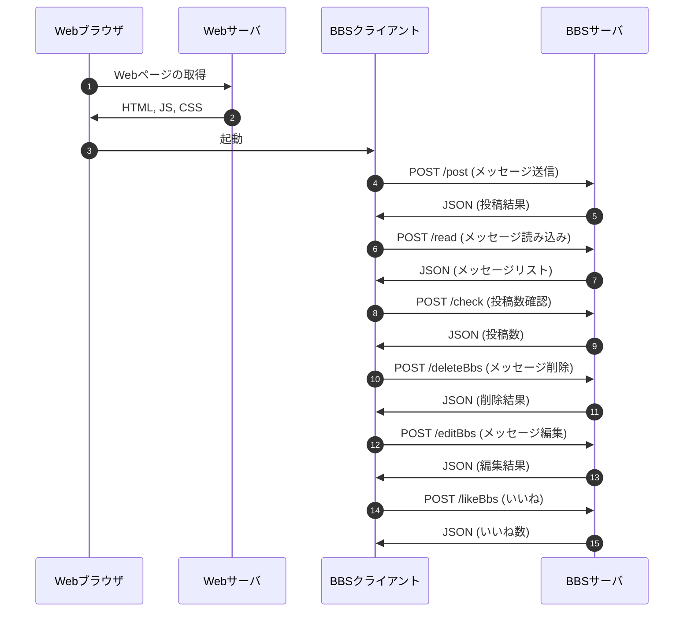

```mermaid
sequenceDiagram
  autonumber
  Webブラウザ ->> Webサーバ: Webページの取得
  Webサーバ ->> Webブラウザ: HTML, JS, CSS
  Webブラウザ ->> BBSクライアント: 起動
  BBSクライアント ->> BBSサーバ: POST /post (メッセージ送信)
  BBSサーバ ->> BBSクライアント: JSON (投稿結果)
  BBSクライアント ->> BBSサーバ: POST /read (メッセージ読み込み)
  BBSサーバ ->> BBSクライアント: JSON (メッセージリスト)
  BBSクライアント ->> BBSサーバ: POST /check (投稿数確認)
  BBSサーバ ->> BBSクライアント: JSON (投稿数)
  BBSクライアント ->> BBSサーバ: POST /deleteBbs (メッセージ削除)
  BBSサーバ ->> BBSクライアント: JSON (削除結果)
  BBSクライアント ->> BBSサーバ: POST /editBbs (メッセージ編集)
  BBSサーバ ->> BBSクライアント: JSON (編集結果)
  BBSクライアント ->> BBSサーバ: POST /likeBbs (いいね)
  BBSサーバ ->> BBSクライアント: JSON (いいね数)

```